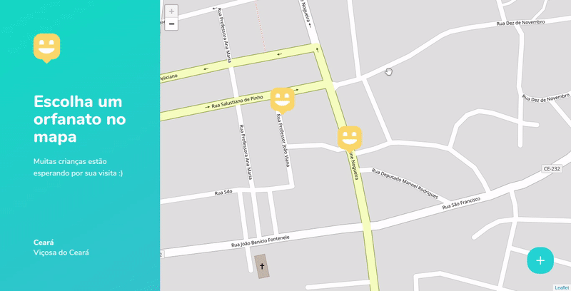
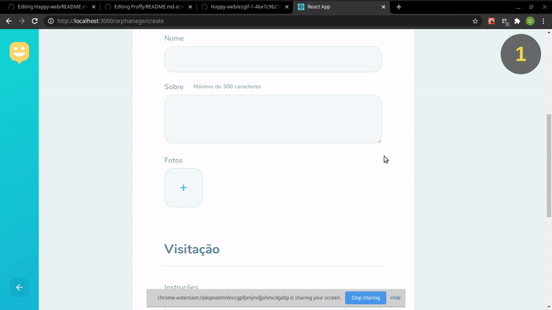

<h1 align="center">
  
</h1>

# Sobre
<p>
Happy é uma plataforma que permite encontrar os orfanatos mais próximos, nesta versão WEB o usuário poderá buscar em um mapa interativo
orfanatos na região além de pode cadastrar orfanatos na plataforma. (Conheça também o <a href="https://github.com/DausterBarbosa/Happy-server" target="_blank">BACKEND</a> desta aplicação e sua versão <a href="https://github.com/DausterBarbosa/Happy-mobile" target="_blank">MOBILE</a>)
</p>

# Tecnologias
<p>
Essas foram as pincipais tecnologias usadas no desenvolvimento do Happy web.
</p>
<ul>
  <li>Typescript</li>
  <li>React</li>
</ul>

# Demonstração


<p>Demonstração do upload de multiplas imagens para aplicação e posteriormente para o <a href="https://github.com/DausterBarbosa/Happy-server" target="_blank">BACKEND</a></p>
  


# Como rodar o projeto

### Clone o projeto

```
# Clone o repostiório
$ git clone https://github.com/DausterBarbosa/Happy-web.git
```

### Rodar aplicação web
```
# Vá para a pasta da aplicação web
$ cd Happy-web

# Instale as dependências
$ yarn

# inicie a aplicação
$ yarn start
```

# Licença
<p>
Este projeto está sob a licença do MIT. Consulte a LICENÇA para obter mais informações.
</p>
